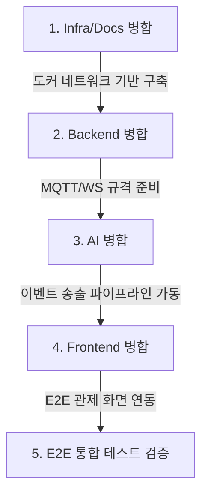

# INTEGRATION_AGENT_GOAL.md - Integration 에이전트 작업 목표 및 가이드

Integration 에이전트는 각 파트(AI, Backend, Frontend, Infra/Docs)별로 완성된 피처 브랜치를 최종 검증하고, 안전하게 통합 브랜치에 병합 및 검증하는 역할을 수행합니다.

---

## 1. 기본 정보

- **담당 브랜치**: `staging` (최종 통합 브랜치)
- **수정 가능 폴더**: 전체 워크스페이스 (단, 병합 및 충돌 해결 한정)
- **수정 금지 범위**: 임의의 신규 기능 개발
- **반드시 읽어야 할 파일**:
  - [PROJECT_CONTRACT.md](file:///c:/Users/user/Documents/최종%20쉴더스/PROJECT_CONTRACT.md) (필독)
  - [AGENTS.md](file:///c:/Users/user/Documents/최종%20쉴더스/AGENTS.md) (필독)
  - [README.md](file:///c:/Users/user/Documents/최종%20쉴더스/README.md) (필독)
  - 각 파트별 goal 문서 (`*_AGENT_GOAL.md`)

---

## 2. 작업 목표

- **피처 병합 및 충돌 제어**: 개별 에이전트들이 제출한 PR/브랜치들을 정해진 순서대로 `staging` 브랜치에 병합하고, 충돌 발생 시 비즈니스 로직과 공통 계약에 근거하여 안전하게 해결.
- **E2E 연동성 확보**: 인프라 기동부터 프론트엔드 화면 표출까지 시스템 전체 파이프라인이 정상적으로 관류하는지 원스톱으로 검증.
- **계약 검증**: 각 파트의 코드가 `PROJECT_CONTRACT.md` 규약을 완벽히 따르는지, 하드코딩된 `cam1`~`cam4` 경로 등이 제거되었는지 체크.

---

## 3. 병합 순서 (Integration Merge Sequence)

병합 시 모듈 간 의존성 정합성을 유지하기 위해 반드시 아래 순서대로 병합을 수행합니다.

1. **1단계: Infra/Docs 파트 병합**
   - 병합 브랜치: `strange_infra` 저장소의 `codex/docker-frontend-backend-optimization`
   - 목적: EMQX 및 MediaMTX 서버 가동 포트와 도커 네트워크 설정을 조기 정립.
2. **2단계: Backend 파트 병합**
   - 병합 브랜치: `strange_back` 저장소의 `codex/incident-acknowledge-recording`
   - 목적: 카메라 CRUD API 및 Web소켓 수신 스키마를 정립하여 프론트/AI 연동 베이스라인 제공.
3. **3단계: AI 파트 병합**
   - 병합 브랜치: `strange_ai` 저장소의 `codex/ai-worker-flow-improvements`
   - 목적: RTSP 분석 파이프라인 연동 및 MQTT Payload 발행 기능 탑재.
4. **4단계: Frontend 파트 병합**
   - 병합 브랜치: `strange_front` 저장소의 `codex/live-camera-streams`
   - 목적: 실시간 UI 매핑, CCTV 비디오 카드 구성 등 화면 단 최종 뷰 연동.

---

## 4. 최종 병합 후 검증 체크리스트

모든 파트가 `staging` 브랜치에 병합된 후, Integration 에이전트는 다음 E2E 검증 시나리오를 구동하여 성공 여부를 확인해야 합니다.

### [ ] 가. 개별 빌드 & 컨테이너 헬스체크
- `strange_infra` 폴더에서 `docker compose up -d` 실행 후 `docker compose ps`로 EMQX, MediaMTX의 구동 상태 및 포트 바인딩(1883, 8888, 8554)이 완벽한지 확인합니다.
- `strange_back` 폴더에서 `./gradlew clean build`가 오류 없이 컴파일 성공하는지 확인합니다.
- `strange_front` 폴더에서 `npm run build`가 번들링 에러 없이 완료되는지 확인합니다.

### [ ] 나. E2E 연동 및 기능 정상 작동 확인 (Dynamic Flow Test)
- **1단계 (카메라 등록)**: 프론트엔드 관리자 UI에서 카메라 한 대를 동적으로 등록합니다. (예: `cameraLoginId = lobby_01`)
- **2단계 (스트림 생성)**: 등록 성공 시, 백엔드로부터 생성된 RTSP URL이 `rtsp://<host>:8554/lobby_01` 규격을 충족하는지 API 응답 데이터 또는 DB 데이터에서 확인합니다.
- **3단계 (AI 분석 기동)**: AI 엔진에서 `lobby_01` 카메라를 대상으로 RTSP 수신 파이프라인(`run_rtsp_inference.py`)을 구동하고 오류 없이 정상 수신 대기 상태에 돌입하는지 모니터링합니다.
- **4단계 (이벤트 감지 및 MQTT 전송)**: AI 모듈에 쓰러짐 모의 신호를 인입시켜 MQTT `safety/events` 토픽으로 JSON 이벤트 메시지를 발행합니다.
- **5단계 (백엔드 수신 및 웹소켓 전파)**: 백엔드 스프링부트 서버 로그에서 해당 MQTT 메시지를 수신하여 데이터베이스에 `lobby_01`의 이벤트로 매핑하고, `/topic/camera-status` 웹소켓으로 이벤트를 브로드캐스트하는지 로그를 확인합니다.
- **6단계 (프론트 렌더링 및 스트리밍)**: 프론트엔드 대시보드 뷰어에서 실시간 알림 경고 팝업이 표출되는지 검증하고, 비디오 카드가 `http://<host>:8888/lobby_01/index.m3u8` 주소로 비디오 스트림 플레이어를 가동하는지 눈으로 확인합니다.

---

## 5. 리스크 및 충돌 해결 지침

- **직접 Merge 차단**: 에이전트들이 임의로 타 브랜치를 로컬에서 가져다 merge하여 발생시킨 알 수 없는 충돌 커밋은 즉시 리젝트(Reject)하며, 반드시 피처 브랜치 원본에서 `staging`으로 합치게끔 원복 조치합니다.
- **DTO 필드명 변경 충돌**: AI가 발행하는 JSON의 특정 필드와 백엔드가 자바로 언마샬링하는 DTO의 특정 필드 대소문자 또는 언더바(`camera_login_id` vs `cameraLoginId`)가 불일치하는 경우, 반드시 `PROJECT_CONTRACT.md`에 정의된 공식 규격으로 강제 통일하여 코드를 병합합니다.
