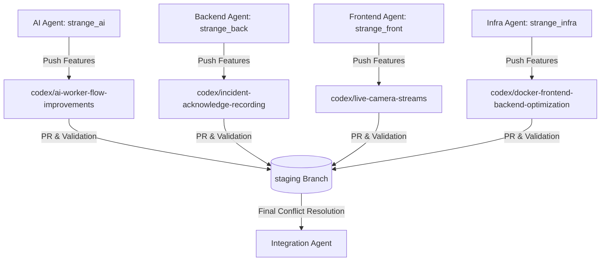

# MULTI_AGENT_PLAN.md - 멀티 에이전트 운영 계획

이 문서는 본 프로젝트를 안정적이고 지속적으로 운영하기 위해 설계된 **멀티 에이전트 분산 협업 계획**입니다. 각 구성 요소가 독립적이고 안전하게 작업할 수 있도록 아키텍처, 브랜치 전략 및 운영 통제 규칙을 정의합니다.

---

## 1. 멀티 에이전트 아키텍처 개요

본 프로젝트의 협업 모델은 각 파트(AI, Backend, Frontend, Infra/Docs)를 담당하는 에이전트들이 **엄격히 독립된 작업 바운더리** 안에서 동작하고, **통합 담당 에이전트(Integration Agent)**가 이를 한곳에서 최종 결합하는 스타형 병합 모델을 채택합니다.

---

## 2. 파트별 에이전트 역할 분배

에이전트는 각 담당 리포지토리 폴더에만 쓰기(Write) 권한을 가집니다. 타 에이전트의 영역에 커밋을 생성하는 것은 제한됩니다.

1. **AI 에이전트**
   - **담당 범위**: `strange_ai/` 폴더
   - **피처 브랜치**: `codex/ai-worker-flow-improvements`
   - **역할**: RTSP 스트림 처리, YOLO 포즈 검출 및 LSTM 행동 인식을 포함한 실시간 추론 파이프라인 안전성 확보 및 성능 최적화.
2. **Backend 에이전트**
   - **담당 범위**: `strange_back/` 폴더
   - **피처 브랜치**: `codex/incident-acknowledge-recording`
   - **역할**: EMQX 브로커로부터 MQTT 이벤트를 구독하여 데이터베이스에 저장하고, 실시간 웹소켓 세션(`/topic/camera-status`)을 관리하는 API 서버 개발.
3. **Frontend 에이전트**
   - **담당 범위**: `strange_front/` 폴더
   - **피처 브랜치**: `codex/live-camera-streams`
   - **역할**: React 기반 안전 관제 대시보드 구현. 실시간 웹소켓 이벤트 렌더링, `cameraLoginId` 기반 동적 HLS 비디오 스트리밍 뷰어 구현.
4. **Infra/Docs 에이전트**
   - **담당 범위**: `strange_infra/` 및 `docs/` 폴더
   - **피처 브랜치**: `codex/docker-frontend-backend-optimization`
   - **역할**: EMQX, MediaMTX, Spring Boot, React 앱의 컨테이너 환경 설정 최적화 및 다이어그램/설계 매뉴얼 갱신.
5. **Integration 에이전트 (통합)**
   - **담당 범위**: 전체 워크스페이스
   - **병합 브랜치**: `staging`
   - **역할**: 개별 피처 브랜치의 최종 검증 및 병합 수행, 충돌(Conflict) 해결 및 시스템 전반의 End-to-End 연동 테스트 수행.

---

## 3. 브랜치 병합 및 충돌 해결 전략

안전한 코드베이스 유지를 위해 **브랜치 간 직접 merge는 전면 금지**됩니다.

- **독립성 유지**: AI 에이전트가 로컬에서 Backend 브랜치를 pull/merge하여 빌드해보는 등의 행위는 금지됩니다. 로컬 테스트가 필요한 경우, Mock 데이터를 활용하거나 공통 계약(`PROJECT_CONTRACT.md`) 문서에 작성된 사양대로 가짜 통신 규격을 만들어 유닛 테스트를 수행합니다.
- **최종 병합 경로**: 각 에이전트는 담당 피처 개발이 완료되고 자체 유닛 테스트를 성공하면 `staging` 브랜치를 대상으로 Pull Request(PR) 또는 병합 요청을 보냅니다.
- **충돌 해결**: 병합 과정에서 충돌이 발생하는 경우, **Integration 에이전트**만이 충돌 해결(Resolve Conflicts) 커밋을 생성할 권한을 가집니다. 충돌이 복잡할 경우, Integration 에이전트는 해당 파트 에이전트들을 소집하여 상호 검증한 후 충돌을 병합합니다.

---

## 4. 공통 계약 및 품질 제어 장치

- **cameraLoginId 기준의 인터페이스 통일**: 모든 에이전트는 카메라 식별자로 `cameraLoginId`를 사용하고, API payload 및 MQTT payload 필드를 맞춥니다.
- **파괴적 명령 금지**: Git 히스토리를 파괴하는 명령(`git reset --hard`, `git push --force`)은 차단되며, 이를 위반할 시 에이전트의 권한이 박탈됩니다.
- **비밀 정보 보호**: `.env` 파일 등 암호 키는 절대 원격 저장소나 코드베이스에 누출되지 않도록 하며, `.gitignore`를 철저히 적용합니다.
- **빌드/테스트 검증**: 병합 승인을 받으려면 각 파트별로 정의된 테스트/빌드 명령어가 성공해야 합니다.
