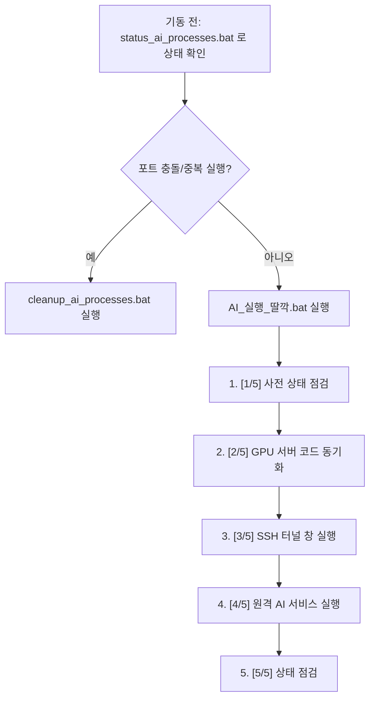

# Windows .bat & GPU Server AI Process Lifecycle Guide

이 문서는 프로젝트 내 Windows `.bat` 스크립트의 역할, 중복 실행 방지 기능, AI/RTSP/ffmpeg/python 프로세스의 안전한 수동/자동 수명 주기 관리 및 상태 점검 방법을 안내합니다.

---

## 1. 배치 파일 목록 및 역할

| 배치 파일 명 | 위치 | 역할 | 관리 상태 |
| :--- | :--- | :--- | :--- |
| **`AI_실행_딸깍.bat`** | 루트 (`/`) | GPU 서버 최신 코드 동기화(develop 브랜치), SSH 터널 개설, MediaMTX/시뮬레이터/AI 러너 기동을 지원하는 공식 통합 런처 | **Active (공식)** |
| **`status_ai_processes.bat`** | 루트 (`/`) | 로컬/원격 포트 점검, 동작 중인 로컬/원격 python/ffmpeg 프로세스 조회, 액티브 워커 레지스트리 및 GPU 점유 현황 통합 진단 스크립트 | **Active (신규)** |
| **`cleanup_ai_processes.bat`** | 루트 (`/`) | 로컬 SSH 터널 제거, GPU 서버 상의 AI 워커/FFmpeg/RTSP 퍼블리셔/MediaMTX 프로세스 점진적 안전 종료 스크립트 (`--dry-run` 지원) | **Active (신규)** |
| `AI_실행_딸깍.bat` | `strange_ai/` | 하브 하드코딩된 구버전 실행기 | **Deprecated (사용 금지)** |
| `gradlew.bat` | `strange_back/` | 백엔드 빌드/실행용 Gradle 래퍼 | **Active (백엔드 전용)** |

> [!WARNING]
> 반드시 루트의 `AI_실행_딸깍.bat`를 사용하십시오. `strange_ai/` 내부의 파일은 중복 실행 방지 및 최신 안정화 터미널 코드가 누락된 예전 버전이므로 사용하지 마십시오.

---

## 2. 안전한 기동 및 종료 흐름



### 2.1. 중복 실행 및 포트 충돌 방지 로직 (로컬 Windows)
`AI_실행_딸깍.bat` 기동 시, 로컬 포트 `8888, 8889, 8189, 18080`이 이미 활성화되어 있는지 점검합니다.
활성화되어 있다면 기존 터널이 열려 있다는 경고와 함께 **자동 정리 여부(Y/N)**를 묻습니다. `Y` 입력 시 자동으로 `cleanup_ai_processes.bat`를 호출하여 이전 좀비 터널을 말끔히 청소한 뒤 안전하게 세션을 다시 기동합니다.

### 2.2. 역방향 백엔드 통신 확인 및 유연한 에러 처리
비밀번호 입력 딜레이로 포트 포워딩 연결이 늦게 완료될 경우, 스크립트가 강제 종료되지 않도록 **Retry / Skip / Exit** 메뉴를 제공합니다. 사용자는 터널 창에 비밀번호 입력을 마친 후 `[1] Retry`를 눌러 다시 통신 유효성을 확인할 수 있습니다.

---

## 3. 카메라 4개 구동 시 정상 프로세스 현황

4개 카메라 등록 기준, 시스템에서 기동되어야 하는 프로세스의 정상 범위는 다음과 같습니다.

### 3.1. 원격 GPU 서버 프로세스 (Linux)
* **Python 프로세스 (총 6개)**:
  * `start_simulated_rtsp_from_folder.py` (시뮬레이터 퍼블리셔) - **1개**
  * `run_registered_cameras.py` (카메라 관리 러너) - **1개**
  * `serve_ai_overlay.py` (카메라별 분석 워커) - **4개**
* **FFmpeg 프로세스 (총 4개)**:
  * 시뮬레이터에서 4개 RTSP 채널을 MediaMTX로 송출하는 ffmpeg 인코더 - **4개**
* **Docker 프로세스 (총 1개)**:
  * `mediamtx` 컨테이너 - **1개**

### 3.2. 로컬 Windows 프로세스
* **SSH 프로세스 (총 2개)**:
  * 백그라운드용 또는 터널 윈도우 창용 `ssh.exe` - **2개**
* **포트 포워딩 포트**:
  * `8888` (HLS), `8889` (WebRTC), `8189` (MediaMTX UI), `18080` (백엔드 리버스 프록시)

---

## 4. 수동 점검 및 트러블슈팅 커맨드

### 4.1. 로컬 Windows 검증 명령어
* **실행 중인 프로세스 조회**:
  ```cmd
  tasklist | findstr /i "ssh.exe java.exe node.exe"
  ```
* **점유 중인 포트 조회**:
  ```cmd
  netstat -ano | findstr /R "LISTENING.*:8888 LISTENING.*:8889 LISTENING.*:18080"
  ```

### 4.2. 원격 GPU 서버 검증 명령어
* **프로젝트 관련 AI 프로세스 조회**:
  ```bash
  ps -eo pid,ppid,cmd | grep -E "python|ffmpeg|run_registered|serve_ai|start_simulated|mediamtx" | grep -v grep
  ```
* **GPU 메모리 점유 및 Compute 프로세스 조회**:
  ```bash
  nvidia-smi
  ```
* **포트 리스너 현황 조회**:
  ```bash
  ss -tlnp | grep -E "8554|8888|8889|8189|18080"
  ```

---

## 5. 종료 스크립트 사용법

모든 AI 프로세스와 SSH 터널을 종료하고 리소스를 반환하려면 아래 스크립트를 사용합니다.

### 5.1. 드라이런 (종료 대상 프로세스 목록 미리보기)
실제 프로세스를 죽이지 않고 어떤 프로세스가 정리 대상인지 안전하게 조회합니다.
```cmd
cleanup_ai_processes.bat --dry-run
```

### 5.2. 실제 프로세스 정리 실행
종료 순서에 따라 원격 AI 워커 -> 원격 시뮬레이터 -> 원격 MediaMTX -> 로컬 터널 순으로 점진적이고 안전하게(SIGTERM -> 대기 -> SIGKILL) 리소스를 종료합니다.
```cmd
cleanup_ai_processes.bat
```

---

## 6. 트러블슈팅: SSH 터널 창 이후 첫 번째 런처가 멈추는 경우

`[3/5] SSH 터널 창 실행` 단계 직후에 첫 번째 터미널(런처)이 무반응 상태로 멈추거나 창이 비정상 종료되는 현상이 발생하면 아래 지침에 따라 진단 및 수정해야 합니다.

### 6.1. 원인 분석 및 추적 로그 확인
런처는 실행 시 자동으로 `logs\` 폴더 하위에 실시간 추적 로그 파일을 생성합니다.
* **로그 파일 경로**: `logs\ai_launcher_trace_YYYYMMDD_HHMMSS.log`
* 문제가 발생했을 때, 로그 파일의 마지막 `TRACE:` 줄을 보고 어느 라인/라벨에서 대기 중이거나 에러가 났는지 파악하십시오.
  * 예: `TRACE: AFTER START SSH WINDOW` 이후의 로그 기록을 보고 원격을 호출하는 `ssh` 통신 도중 멈췄는지 판단 가능합니다.

### 6.2. 런처 배치 파일 관리 규칙
런처 구동 시 아래의 윈도우 배치 파일 작성 수칙이 반드시 지켜져야 합니다.

1. **`start /wait` 사용 금지**:
   * SSH 터널을 비동기 창으로 띄울 때 `start /wait`를 쓰면, 두 번째 SSH 창이 닫힐 때까지 첫 번째 런처의 실행 흐름이 영구 블로킹됩니다. 반드시 단순 `start` 명령을 사용하여 비동기로 띄워야 합니다.
2. **타 배치 파일 호출 시 `call` 명시**:
   * `cleanup_ai_processes.bat` 등 다른 배치 파일을 호출할 때는 반드시 앞에 `call` 접두사를 붙여야 합니다. `call` 없이 단순 호출하면 제어권이 타 배치 파일로 넘어가고 원래 런처로는 복귀하지 못한 채 종료됩니다.
3. **`MODE_STOP` 등의 레이블 낙하(Fall-through) 방지**:
   * 각 비즈니스 로직(기동, 정지)의 정상 종료 지점에는 반드시 명시적으로 `goto SUCCESS` 등을 추가하여, 아래에 위치한 정지(pkill) 또는 에러 처리 레이블로 코드 흐름이 자동으로 떨어지는 일을 원천 차단해야 합니다.

### 6.3. 구버전 스크립트 실행 금지 경고
반드시 프로젝트 **루트(최상위) 디렉토리**에 있는 `AI_실행_딸깍.bat`를 실행하십시오.
`strange_ai\` 하위 폴더에 있는 구버전 배치 스크립트는 추적 로그 시스템, 괄호 파싱 예방 및 `call`/`goto` 예외 안전망이 누락되어 있으므로 **절대 실행하지 마십시오.**
---

## 2026-07-01 ffmpeg publisher lifecycle note

The stable launcher should prefer:

```bash
python scripts/start_simulated_rtsp_from_folder.py --ffmpeg-mode auto
```

Temporary safe mode while NVENC is unstable:

```bash
python scripts/start_simulated_rtsp_from_folder.py --ffmpeg-mode copy
```

Expected process shape for four simulated cameras:

* one `start_simulated_rtsp_from_folder.py` parent process
* four ffmpeg publisher child processes
* no repeated `Force killing existing publisher` during ordinary crash recovery
* no repeated `Scavenged and killing duplicate ffmpeg publisher` during ordinary crash recovery
* no `[ffmpeg] <defunct>` entries after cleanup

The simulator writes a lock file at `runs/simulated_rtsp/start_simulated_rtsp_from_folder.lock` to prevent duplicate parent instances. If startup reports an existing running PID, use the normal cleanup script instead of starting a second publisher.
