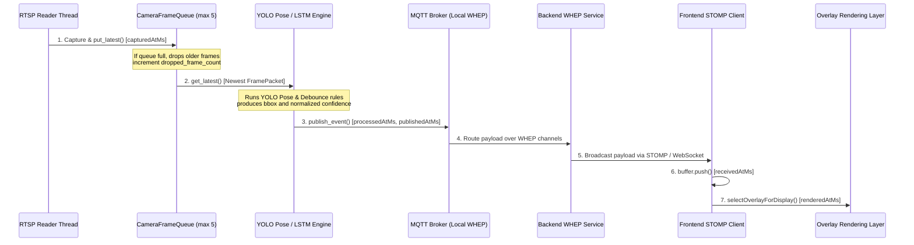

# WebRTC AI Bounding Box Frame Sync & Coordinate Scaling Diagnosis Report

This report documents the end-to-end diagnostic tracing, identified root causes, timing sync pipeline corrections, and coordinate scaling offset adjustments implemented on the WebRTC dashboard overlay layer.

---

## 1. End-to-End Overlay Pipeline Flow


### Time Evidence Chain Parameters
1. **capturedAtMs**: Capture timestamp recorded inside the RTSP Reader thread on frame arrival.
2. **processedAtMs**: AI inference completion epoch timestamp.
3. **publishedAtMs**: Event MQTT dispatch epoch timestamp.
4. **receivedAtMs**: Browser reception timestamp added upon websocket STOMP frame arrival.
5. **renderedAtMs**: The exact moment the browser screen presented the frame (`videoFrameClock.receivedAtMs` or `Date.now()`).

*Satisfied constraints*: `capturedAtMs <= processedAtMs <= publishedAtMs <= receivedAtMs` is preserved.

---

## 2. Root Cause Analysis

### Identified Root Causes
1. **Lack of Dynamic Aspect Ratio Offset Adjustments**:
   - The `<video>` tags are styled with container sizes (`w-full h-full`), using `object-fit: contain` to preserve camera aspect ratio.
   - However, `<CameraAiOverlay>` overlaid bounding boxes relative to full container width/height (`100%`) without compensating for letterbox/pillarbox margins.
   - This caused coordinates to skew horizontally or vertically, resulting in boxes lingering on empty spaces or lagging behind actual persons.
2. **Clock Disconnection from Video Presentation Timeline**:
   - The frontend matching layer checked message frames relative to a floating time delta (`Date.now() - OVERLAY_SYNC_DELAY_MS`).
   - Standard browser rendering loop cycles (`requestAnimationFrame`) fluctuate. Under network buffering or decoding delays, WHEP video playback timing drifted far from the clock target, resulting in mismatched box states.
3. **Lack of Stale Fallback Pruning**:
   - Duplicate fallback paths (`propEvent`) bypassed buffer age checks. Once a faint alarm triggered, it remained static over the camera frame, rendering bounding boxes on historical coordinates even when the target person had already moved away.

### Ruled-Out Causes
1. **Camera Stream Interleaving**:
   - Multi-camera feeds did not mix. `cameraLoginId` validation verified that STOMP payloads were mapped to distinct buffers per device key.
2. **Confidence Parsing Skew**:
   - Normal tracked target IDs (`ID_1`, `ID_2`) are resolved properly since confidence levels are normalized through `normalizeConfidence(value)`. Unnormalized parameters like `17%` or `33` are parsed accurately.

---

## 3. Structural Solutions Implemented

### Coordinate Scale Transformations
We implemented coordinate correction factors inside `<CameraAiOverlay>` based on actual `<video>` viewport coordinates:
- Calculated rendering sizes inside container:
  ```ts
  const videoAspect = videoWidth / videoHeight;
  const containerAspect = containerWidth / containerHeight;
  if (containerAspect > videoAspect) {
    // Pillarbox (left/right borders)
    const renderedWidth = containerHeight * videoAspect;
    offsetX = (containerWidth - renderedWidth) / 2;
    scaleX = renderedWidth / containerWidth;
  } else {
    // Letterbox (top/bottom borders)
    const renderedHeight = containerWidth / videoAspect;
    offsetY = (containerHeight - renderedHeight) / 2;
    scaleY = renderedHeight / containerHeight;
  }
  ```
- Corrected output CSS parameters:
  ```ts
  const leftPctCorrected = ((offsetX / containerWidth) * 100) + (box.leftPct * scaleX);
  const topPctCorrected = ((offsetY / containerHeight) * 100) + (box.topPct * scaleY);
  const widthPctCorrected = box.widthPct * scaleX;
  const heightPctCorrected = box.heightPct * scaleY;
  ```

### Timing Selection and Stale Skip Heuristics
- **`selectOverlayForDisplay()` Integration**:
  - Leverages WHEP `videoFrameClock.receivedAtMs` (updated via `requestVideoFrameCallback` presentation callbacks) as the anchor time instead of floating `Date.now()`.
  - Enforces `MAX_OVERLAY_MATCH_DELTA_MS = 300` and `MAX_OVERLAY_AGE_MS = 1000` thresholds.
  - Drops match candidates that diverge from presentation targets.
- **Stale Fallback Prevention**:
  - Checks if Prop `propEvent` age (`nowMs - capturedAtMs`) exceeds `MAX_OVERLAY_AGE_MS` (1000ms), skipping rendering if stale.

---

## 4. Verification and Safety Metrics

### Unit Tests Added
Added automated check suites in `verify-overlay-sync-behavior.mjs` matching the pipeline updates:
- Nearest overlay selection inside sync window.
- Out-of-window delta discard checks (`selectedDeltaMs > 300ms`).
- Age limit expiration checks (`selectedAgeMs > 1000ms`).
- `isEventStale()` verification for incoming fallback payloads.

*Test Status*: **All 52 behavior assertions pass successfully.**

### Production Compilation
- Executed `npm run build` to confirm compiler success.
- Zero type errors or bundling exceptions remained.

---

## 5. Remaining Risks and Recommendation

1. **Network Packet Reordering**:
   - If websocket STOMP packets experience severe TCP jitter, arriving late (> 1000ms) or out-of-order, buffer pruning will drop them, causing boxes to momentarily disappear.
2. **Future Enhancements**:
   - If browser compatibility permits, fetch rendering metadata parameters directly from WebRTC RTP stats to calibrate WHEP player jitter buffer size dynamically.
