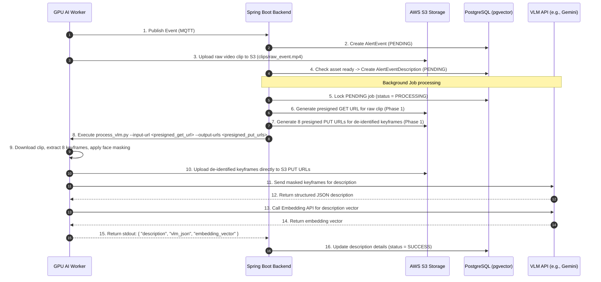

# VLM & RAG Architecture: Data Flow & Phases

> [!NOTE]
> **Antigravity Internal Artifact Notice**
> This directory and its contents (`brain/vlm-rag/*.md`) are internal planning artifacts generated for Antigravity's pairwise workspace context. They are NOT directly committed to the main repository code lines. 
> *Open Question*: Should we place a summary document in a permitted location in the repository (e.g., under `strange_ai/` or `strange_back/` READMEs) upon completion of the implementation?

This document describes the high-level architecture, S3 presigned URL integration, and Phase-wise division for the VLM description generation and RAG semantic search MVP.

---

## 1. Phase Division

### Phase 1: Backend & Core Pipeline (Current Turn)
1. **Database Migration**: Create `alert_event_descriptions` table with pgvector support.
2. **JPA Entity and Repository Mapping**: Create `AlertEventDescription` entity and repo.
3. **Python-processing Presigned URLs**: Implement generation of S3 presigned GET URL (for Python downloading the raw video clip) and S3 presigned PUT URLs (for Python uploading de-identified keyframes) in the Spring Boot backend.
4. **Python VLM Processing Script (`process_vlm.py`)**: Script that takes S3 presigned URLs, samples 8 keyframes, applies face ROI masking, calls VLM/Embedding APIs, uploads masked keyframes to S3 PUT URLs, and outputs JSON.
5. **Java Embedding Client**: Implement direct HTTP client calls using Gemini API Key to the `text-embedding-004` embedding API in the Java backend for query embedding.
6. **Async Job Scheduler (`VlmPostProcessingScheduler`)**: Polling scheduler to lock and process PENDING description jobs with concurrency locks and stuck recovery.
7. **Search API Endpoint**: Expose `GET /api/search/semantic` with threshold and metadata filtering.
8. **Backend Unit & Integration Tests**: Validate the state machine, Python script execution, and vector search query.

### Phase 2: Frontend & Evaluation (Next Turn)
1. **Frontend Search UI Panel**: Natural language search bar and matched events list in the React dashboard.
2. **Frontend Presigned URLs**: Generate presigned URLs for browser-facing de-identified keyframe previews.
3. **Search Quality Evaluation Suite**: Implementation of `tests/evaluation_queries.json` to verify semantic search threshold and accuracy.

---

## 2. System Data Flow

---

## 3. S3 Presigned URL Design

Since the Python process on the GPU server does not have direct AWS S3 credentials, the Java backend manages S3 read/write authorization:

- **GET Presigned URL (Phase 1)**: Generated for the raw clip (`source_asset_key`) with a 5-minute expiration time. Python uses this URL to download the clip.
- **PUT Presigned URLs (Phase 1)**: Java generates 8 S3 keys for the de-identified keyframes (e.g. `deidentified/cam_02/evt-123_frame0.jpg`) and creates 8 PUT presigned URLs. Python uploads the masked JPEG frames directly to S3 using standard HTTP PUT requests with these URLs.

---

## 4. Phase 1 Implementation Checklist

- [x] Write DB schema migration script `V2__add_vlm_descriptions.sql`.
- [ ] Implement Java S3 presigned GET and PUT URL generator methods for VLM processing.
- [ ] Implement `process_vlm.py` (downloading, de-identifying, VLM API calling, uploading keyframes, and printing JSON).
- [ ] Create Java `EmbeddingService` that makes direct HTTP calls to the Gemini Embedding API for query embedding.
- [ ] Create `VlmPostProcessingScheduler` executing the Python process and handling state updates.
- [ ] Implement semantic search repository native query and REST endpoint `GET /api/search/semantic`.
- [ ] Run backend unit tests validating the scheduler, embedding HTTP mock, and similarity search.
