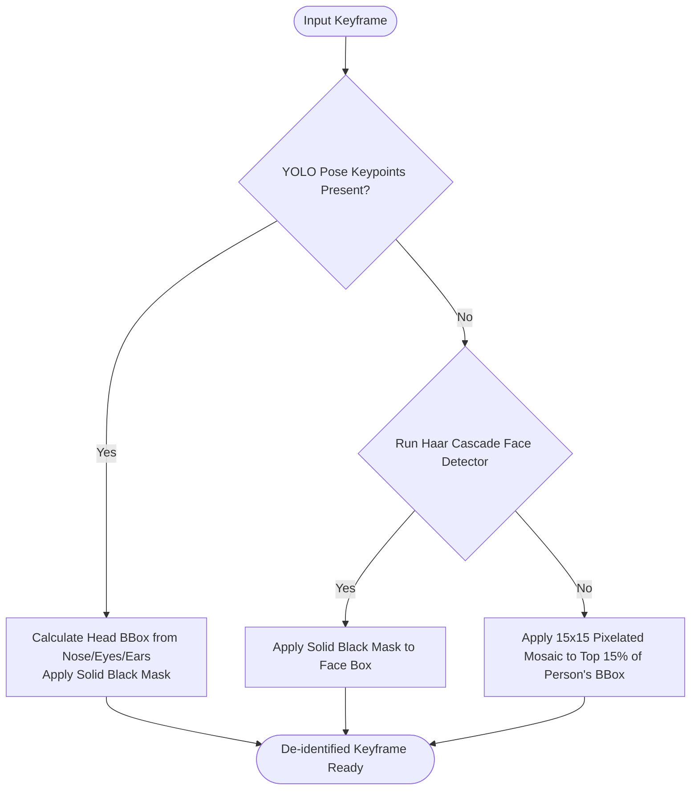

# Keyframe Extraction & Face De-Identification Pipeline

This document details the keyframe sampling strategy and the multi-layered face ROI de-identification logic used to protect privacy before VLM API submission.

---

## 1. VLM Input Keyframe Sampling

To avoid excessive token usage and remain within rate limits, the Python script extracts **8 keyframes** from the raw 10-second clip task.
- The sampling indexes are determined dynamically based on the total frame count of the clip:
  - Sampling offsets: `0% (Start), 15%, 30%, 45%, 60% (Peak), 75%, 90%, 100% (End)`.
- Each frame is resized to the target `mjpeg_width` / `mjpeg_height` (default 720p) before de-identification and encoding.

---

## 2. Multi-Layer Face ROI Detection Priority

Face masking is applied in-place on the extracted keyframes in a strict sequence:



### Priority 1: YOLO Pose Keypoints
If the event metadata contains YOLO Pose keypoints from the tracker, Python uses these to estimate the head bounding box.

#### YOLO Pose Keypoint JSON Payload Format
The keypoint data passed in the event metadata conforms to this strict JSON schema:
```json
{
  "track_id": 1,
  "frame_index": 120,
  "bbox_xyxy": [120, 240, 280, 640],
  "keypoints": [
    [185.2, 260.5, 0.91], 
    [175.1, 250.2, 0.88], 
    [195.3, 250.4, 0.87], 
    [160.4, 255.1, 0.79], 
    [210.2, 255.5, 0.81]
  ],
  "confidence": 0.89,
  "coordinate_space": "absolute_pixel"
}
```
*Note*: The keypoints array follows COCO format where indices 0-4 represent: `0: nose, 1: left_eye, 2: right_eye, 3: left_ear, 4: right_ear`.

#### Keyframe Matching Rule (Frame Interpolation)
Since the clip extracts 8 keyframes at specific timestamps, and the keypoint logs are recorded continuously:
- For each selected keyframe, find the closest frame in the pose tracking history by matching `frame_index` or timestamp.
- **Max Distance Fallback**: If the nearest available pose frame is more than **1.0 second** (or 30 frames at 30 FPS) away from the keyframe, the keypoint data is considered stale. The system will fall back to **Priority 2 (Haar Cascade)** or **Priority 3 (Top 15% Mosaic)**.

#### Head BBox Calculation
If valid keypoints are found:
- **Nose coordinates** define the center of the face.
- **Ear-to-ear or eye-to-eye distance** determines the width and height of the box.
- Apply a **solid black rectangle** mask over the calculated head bbox.
- *Why*: Highly robust for tilted/lying postures on CCTV where traditional frontal face detectors fail.

### Priority 2: Haar Cascade Classifier
If keypoints are missing or stale, run the OpenCV Haar Cascade face detector (`haarcascade_frontalface_default.xml`) restricted within the person's bounding box.
- Apply a **solid black rectangle** mask over the detected face box.

### Priority 3: Top 15% Mosaic Fallback
If both methods fail to detect the face/head, fallback to applying a **15x15 pixelated mosaic filter** to the top 15% of the person's bounding box.

---

## 3. Known Risks

> [!WARNING]
> **Safety Helmet & Headgear Feature Resolution Loss**
> Applying the Top 15% Mosaic fallback pixelates the upper portion of the person's bounding box. While this ensures face privacy, it can degrade the resolution of safety helmets/hardhats/headgear. This may decrease the VLM's confidence when determining if safety equipment was worn.

---

## 4. S3 Storage & Keyframe Linking
- The 8 de-identified keyframes are encoded as JPEGs.
- The Python script uploads them to S3 using the PUT presigned URLs provided by Java.
- The resulting S3 keys are returned as a JSON array (`deidentified_keyframe_keys`), e.g., `["deidentified/cam_02/evt-123_frame0.jpg", ...]`.

---

## 5. Phase 1 Implementation Checklist

- [ ] Write keyframe sampling generator logic in Python.
- [ ] Implement keyframe matching rule (finding closest pose frame within 1.0s window).
- [ ] Implement head bbox estimation using YOLO Pose keypoints.
- [ ] Set up OpenCV Haar Cascade face classifier within person bboxes.
- [ ] Implement the 15% height mosaic fallback filter.
- [ ] Write unit tests (`test_vlm_process.py`) verifying that the de-identification masks apply correctly under all three scenarios.
