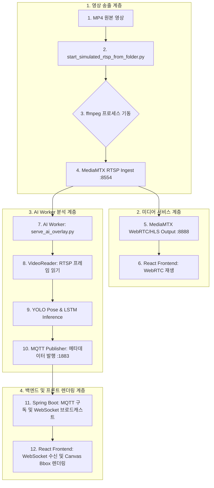

# WebRTC Video & Bbox Overlay Disconnect Diagnosis Guide

이 문서는 WebRTC 영상 송출과 Bbox Overlay 메타데이터가 동시에 또는 주기적으로 끊기는 현상을 전체 파이프라인 관점에서 추적하고, 원인을 분석/수정하기 위한 진단 표준 및 해결 가이드라인을 제공합니다.

---

## 1. 전체 데이터 흐름 및 파이프라인

데이터는 아래의 12단계 흐름에 따라 실시간으로 송출, 처리 및 렌더링됩니다.



---

## 2. 끊김 원인 분류 및 식별 지표 (Disconnect Taxonomy)

영상이나 bbox가 끊어졌을 때, 아래의 증거 수집 처를 대조하여 원인을 격리합니다.

| 원인 구분 | 주된 증상 | 확인용 진단 명령 / 로그 패턴 | 해결 방안 |
| :--- | :--- | :--- | :--- |
| **1. ffmpeg publisher 종료** | 특정 카메라의 영상만 멈춤 (검은 화면). | `pgrep -af ffmpeg`<br>`runs/simulated_rtsp/{cameraLoginId}-ffmpeg.log` 확인 (종료 코드/NVENC 에러 여부) | `start_simulated_rtsp_from_folder.py`에서 1초 주기 프로세스 폴링 및 자동 재기동 수행 |
| **2. MediaMTX Ingest 끊김** | 미디어 서버 로그에 path 오프라인 기록. | `docker logs mediamtx`<br>로그 내용: `[RTSP] publisher disconnected` | ffmpeg 재구동 확인, RTSP path 유효성 검증 |
| **3. WebRTC 피어 재협상 실패** | 미디어 서버/RTSP 송출은 정상이나 화면만 멈춤. | Chrome DevTools -> Console -> `connectionState`가 `failed` 또는 `disconnected` 인지 확인 | 프론트엔드 WebRTC Player Reconnect 정책 수립 |
| **4. AI Worker RTSP Read 실패** | Bbox가 멈춤. CPU/GPU는 여유로우나 메타데이터 무발행. | `serve_ai_overlay.py` 콘솔 로그:<br>`[video-reader] frame read failed`<br>`[heartbeat-reader] read_count=0` | `video_reader.py` 내 OpenCV `OPENCV_FFMPEG_CAPTURE_OPTIONS`에 `rtsp_transport;tcp` 및 `timeout` 5초 지정 |
| **5. AI Worker Exception/Deadlock** | `ps`에는 프로세스가 보이나 하트비트가 전혀 출력 안 됨. | `serve_ai_overlay.py` 로그 파일 확인 (Exception traceback 또는 무반응) | MQTT publish 실패 시 예외 처리 (`try-except`) 보강 |
| **6. MQTT Publish 오류** | AI 분석은 계속되나 이벤트 메타데이터가 백엔드로 가지 않음. | `mosquitto_sub -h localhost -p 1883 -t 'safety/#'`<br>`[ai-worker][error] failed to publish...` | MQTT Client Auto-reconnect 설정 점검, publish 예외 격리 |
| **7. Backend WebSocket 장애** | 백엔드는 작동하나 프론트로 메타데이터가 브로드캐스트 안 됨. | Spring Boot 로그 확인 (`MqttCallback` 에러 여부)<br>브라우저 개발자 도구 Network 탭 -> WS 메시지 흐름 확인 | WebSocket 세션 연결 해제 및 재시도 핸들러 점검 |
| **8. Frontend Buffer / Sync 드롭** | 영상과 프레임 메타데이터 간의 timestamp 차이가 커서 드롭됨. | React 콘솔 로그: `dropped overlay payload due to latency threshold` | WebRTC 비디오 버퍼 레이턴시 튜닝, 오버레이 TTL 완화 |

---

## 3. 정상 상태 동작 기준 (Normal State Baseline)

정상 동작 시의 시스템 리소스 및 프로세스 요건은 아래와 같습니다 (카메라 4개 구동 기준).

* **FFmpeg 프로세스 개수**: 총 **4개** (`pgrep -af ffmpeg`)
* **Python AI Worker 프로세스 개수**: 총 **4개** (`serve_ai_overlay.py`) + 부모 매니저 1개 (`run_registered_cameras.py`)
* **GPU 리소스 요건**: NVENC 세션 4개 점유, GPU Memory 및 Core Util이 80% 이하 유지 (`nvidia-smi`)
* **네트워크 포트 활성**:
  * `8554` (MediaMTX RTSP Ingest)
  * `8888` (MediaMTX WebRTC/HLS Stream 재생)
  * `1883` (Mosquitto MQTT Broker)
  * `18080` (Spring 백엔드 API/WebSocket 포트)

---

## 4. 진단 및 확인 스크립트 모음

### 4.1. 로컬 포트 및 프로세스 확인 (Windows)
```cmd
status_ai_processes.bat
```

### 4.2. 원격 GPU 서버 내 프로세스 진단 (Linux)
```bash
# 1. GPU 프로세스 및 리소스 전체 조회
ps -eo pid,ppid,cmd | grep -E "python|ffmpeg|run_registered|serve_ai|start_simulated|mediamtx" | grep -v grep
nvidia-smi

# 2. ffmpeg 및 AI 워커 개별 카운트 확인
pgrep -af ffmpeg
pgrep -af run_registered_cameras.py
pgrep -af serve_ai_overlay.py

# 3. MediaMTX 로그에서 연결 해제 이력 추적
docker logs --tail=200 mediamtx
```

### 4.3. MQTT 실시간 메타데이터 스트림 직접 모니터링
```bash
mosquitto_sub -h localhost -p 1883 -t 'safety/#' -v
```

---

## 5. 단계별 테스트 시나리오

1. **클린업 수행**: `cleanup_ai_processes.bat`을 실행하여 모든 잔여 프로세스와 터널을 해제합니다.
2. **카메라 1개 테스트 (5분 이상 유지)**:
   * 1개 카메라 등록 후 WebRTC 비디오와 bbox 오버레이가 지속적으로 나오는지 확인합니다.
   * `[heartbeat-reader]`와 `[heartbeat-inference]` 로그가 1초 단위로 끊김 없이 올라오는지 관찰합니다.
3. **카메라 2개 -> 4개 순차적 증설**:
   * 카메라 개수를 점진적으로 늘려가며 `nvidia-smi`를 통해 GPU 세션 초과 에러가 발생하는지 확인합니다.
   * FFmpeg 프로세스 개수가 정확히 카메라 수와 대칭되는지 검증합니다.

---

## 6. 반영된 수정 및 안전 정책

* **OpenCV RTSP Read 소켓 행업 해결**:
  `strange_ai/ai/streams/video_reader.py` 내부 `VideoCapture` 진입 전 `OPENCV_FFMPEG_CAPTURE_OPTIONS`를 활용해 **TCP 전송 강제** 및 **5초 소켓 타임아웃**을 적용하여 네트워크 순간 단절 시 무한 대기에 빠지지 않도록 구조를 변경했습니다.
* **FFmpeg 신속 재기동**:
  `start_simulated_rtsp_from_folder.py` 내의 모니터링 루프 주기를 30초에서 1초로 단축하여, ffmpeg 장애 발생 시 1초 내로 인지 및 자동 복구를 진행하도록 개편했습니다.
* **MQTT 발행 예외 격리**:
  `serve_ai_overlay.py` 내부의 모든 `publisher.publish(...)` 호출을 `try-except`로 감싸 브로커 단절이 분석 스레드를 정지(Crash)시키지 못하도록 보강했습니다.
---

## 7. 2026-07-01 ffmpeg publisher lifecycle update

Current default:

```bash
python scripts/start_simulated_rtsp_from_folder.py \
  --video-dir /path/to/videos \
  --backend-url http://127.0.0.1:18080 \
  --ffmpeg-mode auto
```

Mode policy:

* `auto`: checks `h264_nvenc` and `nvidia-smi`; starts with `nvenc` only when both are available, otherwise starts with `copy`.
* `nvenc`: forces NVENC first, but falls back after failures unless `--no-ffmpeg-fallback` is set.
* `copy`: remuxes without re-encoding; use this as the safest temporary mode when NVENC is unstable.
* `cpu` / `libx264`: browser-safe CPU encode profile.

Runtime safety:

* A lock file at `runs/simulated_rtsp/start_simulated_rtsp_from_folder.lock` prevents duplicate simulator parent processes.
* On ffmpeg exit, the parent calls `wait()` before restart so terminated children are reaped.
* Restart handling unregisters the dead publisher instead of repeatedly calling duplicate scavenging on normal crash recovery.
* Exit logs include the code, camera id, last ffmpeg log lines, restart count through the mode policy, and known hints such as `h264_nvenc`, `Cannot load libcuda`, `Device busy`, `Connection refused`, and `already publishing`.

Recommended checks:

```bash
ffmpeg -hide_banner -encoders | grep -E "nvenc|libx264|h264"
ffmpeg -hide_banner -hwaccels
nvidia-smi
pgrep -af start_simulated_rtsp_from_folder.py
pgrep -af ffmpeg
ps -eo pid,ppid,stat,cmd | grep -E "start_simulated|ffmpeg" | grep -v grep
curl -I http://127.0.0.1:8888/cam_01/index.m3u8
curl -I http://127.0.0.1:8888/cam_02/index.m3u8
curl -I http://127.0.0.1:8888/cam_03/index.m3u8
curl -I http://127.0.0.1:8888/cam_04/index.m3u8
```
