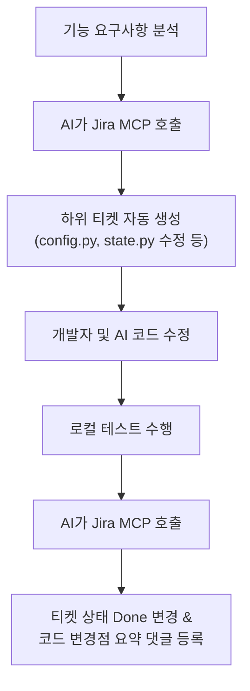

# 🛠️ Jira - MCP 연동 종합 가이드 (Antigravity & Cursor & Claude Desktop)

본 가이드는 AI 에이전트(**Antigravity**, Cursor, Claude Desktop 등)와 Atlassian Jira를 **MCP(Model Context Protocol)**를 통해 연동하여 **"자동 할 일 분할(Task Decomposition)"** 및 **"작업 완료 상태 자동 추적(Action Tracking)"**을 구축하기 위한 가이드라인입니다.

**Antigravity의 경우 이미 설정 파일을 해당 시스템 폴더(`C:\Users\user\.gemini\antigravity\mcp_config.json`)에 직접 생성해 두었습니다!** 

아래 단계별 안내를 따라 발급받으신 API 토큰 값만 입력하시면 바로 연동이 시작됩니다.

---

## 👽 0단계: Antigravity (현재 AI 에이전트) 연동하기 (자동 세팅됨!)

현재 pair programming을 함께 하고 계시는 **Antigravity** 에이전트에 지라를 연동하여 지라 관리를 전담시키는 방법입니다. 

1. **설정 파일 위치**
   * `C:\Users\user\.gemini\antigravity\mcp_config.json` (저희가 이미 파일을 생성해 두었습니다!)
2. **토큰 및 주소 수정**
   * 해당 경로의 `mcp_config.json` 파일을 여신 후 다음 값을 실제 값으로 수정해 주세요:
     * `"JIRA_URL"`: 본인의 Jira 주소 (예: `https://company.atlassian.net`)
     * `"JIRA_EMAIL"`: Atlassian 계정 이메일 주소
     * `"JIRA_API_TOKEN"`: 1단계에서 발급받은 API 토큰
3. **효과**
   * 설정이 완료되면 저(**Antigravity 에이전트**)에게 *"지라에서 이슈 조회해줘"*, *"이슈 생성해줘"* 등의 작업을 시킬 수 있으며, 제가 사용자를 대신해 작업 분할 및 티켓 업데이트를 완전히 자동화해 드립니다.

---


## 🔑 1단계: Jira API 토큰 발급받기

Jira MCP 서버가 사용자를 대신하여 프로젝트에 접근하고 이슈를 관리하려면 **Atlassian API 토큰**이 필요합니다.

1. **Atlassian API Tokens 페이지로 이동**
   * [https://id.atlassian.com/manage-profile/security/api-tokens](https://id.atlassian.com/manage-profile/security/api-tokens)에 접속하여 로그인합니다.
2. **토큰 생성**
   * **API 토큰 만들기 (Create API token)** 버튼을 클릭합니다.
   * 토큰 이름(Label)을 입력합니다. (예: `mcp-ai-agent`)
   * **만들기 (Create)** 버튼을 클릭합니다.
3. **토큰 저장**
   * 생성된 토큰 값은 **단 한 번만 표시**됩니다. **[복사]**를 눌러 안전한 텍스트 파일이나 비밀번호 관리자에 즉시 복사해 둡니다.

> [!CAUTION]
> API 토큰은 사용자의 Jira 권한을 그대로 가집니다. 외부 퍼블릭 Git 저장소(Github 등)에 노출되지 않도록 각별히 유의해 주세요.

---

## 💻 2단계: Claude Desktop 연동하기 (복사 & 붙여넣기)

Claude Desktop 앱을 Jira MCP 서버와 연결하려면 설정 파일에 설정을 추가해야 합니다.

1. **설정 파일 위치 탐색**
   * 윈도우 탐색기 주소창에 `%APPDATA%\Claude`를 입력하고 엔터를 누릅니다.
   * 해당 폴더 안의 `claude_desktop_config.json` 파일을 메모장이나 VS Code로 엽니다. (파일이 없다면 새로 만드시면 됩니다.)

2. **설정 붙여넣기**
   * 아래의 내용을 복사하여 기존 JSON 설정 안에 병합합니다. (또는 [claude_desktop_config_jira.json](file:///c:/최종프로젝트%20mvp/claude_desktop_config_jira.json)을 그대로 사용하셔도 됩니다.)

```json
{
  "mcpServers": {
    "jira-community": {
      "command": "npx",
      "args": [
        "-y",
        "jira-mcp"
      ],
      "env": {
        "JIRA_URL": "https://your-domain.atlassian.net",
        "JIRA_EMAIL": "your-email@example.com",
        "JIRA_API_TOKEN": "YOUR_JIRA_API_TOKEN_HERE"
      }
    }
  }
}
```

3. **값 커스텀하기**
   * `JIRA_URL`: 사용 중이신 Jira 주소로 변경합니다. (예: `https://company-name.atlassian.net`)
   * `JIRA_EMAIL`: Jira 로그인에 사용하는 Atlassian 계정 이메일 주소를 입력합니다.
   * `JIRA_API_TOKEN`: 1단계에서 발급받은 API 토큰을 입력합니다.
4. **적용 및 재시작**
   * 파일을 저장하고 **Claude Desktop 앱을 완전히 종료(우측 하단 트레이 아이콘에서 Exit)한 뒤 재시작**합니다.
   * 채팅 창 오른쪽 하단에 🔌 아이콘이 생기며 클릭 시 `jira-community` 도구 리스트(예: `create_issue`, `get_issue` 등)가 표시되면 성공입니다!

---

## 🚀 3단계: Cursor IDE 연동하기 (GUI 방식)

Cursor 개발 툴에서 Jira MCP 서버를 직접 연동하면 개발 중인 소스코드와 지라 티켓을 실시간으로 싱크할 수 있어 생산성이 극대화됩니다.

1. **Cursor 설정 열기**
   * Cursor 우측 상단의 ⚙️ **(Cursor Settings)** 아이콘을 클릭합니다.
2. **Features ➔ MCP 메뉴 이동**
   * 왼쪽 탭에서 **Features**를 선택하고 아래로 스크롤하여 **MCP** 구역으로 이동합니다.
3. **새 MCP 서버 추가 (+ Add New MCP Server)**
   * **Name**: `Jira-MCP`
   * **Type**: `command`
   * **Command**: 
     ```bash
     npx -y jira-mcp
     ```
   * **Environment Variables (환경 변수)** 추가:
     * `JIRA_URL`: `https://your-domain.atlassian.net` (본인의 Jira 주소)
     * `JIRA_EMAIL`: `본인계정이메일@example.com`
     * `JIRA_API_TOKEN`: `1단계에서 발급받은 API 토큰`
4. **저장 (Save)**
   * 저장 버튼을 누르고 상태 표시등이 🟢 **Green**으로 변하는지 확인합니다.

---

## ⚡ 4단계: 실전! AI 자동 업무 자동화 프롬프트 템플릿

연동이 완료된 후, AI 에이전트(Cursor Composer 혹은 Claude Chat)에 아래와 같이 프롬프트를 내려 지라 작업을 제어해 보세요.

### 📋 프롬프트 템플릿 1: 기능 개발 시 "할 일 자동 쪼개기"
> **프롬프트 예시:**
> *"이번에 우리 Vision MVP 시스템에 **'RTSP 재연결 핸들러 및 자동 로그 저장'** 기능을 구현해야 해. 
> 1. 이 변경 사항이 `config.py`와 `rtsp_utils.py`, `main.py`에 미칠 영향을 분석해 줘.
> 2. 분석을 바탕으로 Jira 프로젝트에 해야 할 일들을 3~4개의 세부 하위 태스크(Sub-task)로 쪼개서 자동으로 등록해 줘."*

### 🔄 프롬프트 템플릿 2: 작업 완료 시 "상태 업데이트 및 댓글 등록"
> **프롬프트 예시:**
> *"방금 `rtsp_utils.py` 파일의 재시도 예외 처리를 모두 구현하고 `main.py --mode live`로 테스트를 마쳤어.
> 1. 방금 수정한 코드 차이점(Git Diff)을 요약해서 Jira의 관련 하위 티켓에 진행 상황을 코멘트로 남겨 줘.
> 2. 작업이 끝났으니 해당 티켓의 상태를 **Done**으로 변경해 줘."*

---

## 🌟 Vision MVP 연동 가상 시나리오 예시

현재 작업 중이신 **Advanced Security Vision Intelligence System**의 경우, AI에게 다음과 같이 연동 명령을 수행할 수 있습니다.



본 가이드와 [claude_desktop_config_jira.json](file:///c:/최종프로젝트%20mvp/claude_desktop_config_jira.json)을 활용하여 더 스마트한 프로젝트 협업 환경을 구축해 보세요!
