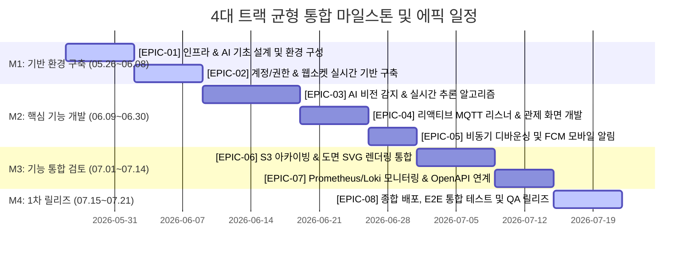

# 📋 AI 비전 안심 매장 보안 시스템 통합 프로젝트 계획서 (4대 트랙 균형 고도화)

본 계획서는 비즈니스/기능적 요구사항(회원관리, N분할 대시보드, 에스컬레이션, FCM 알림)과 실시간 비전 AI 기술 스펙(NVIDIA TensorRT, ByteTrack, Identity Stitching, 3대 위협 시나리오, 4계층 스토리지 구조)을 유기적으로 융합한 **통합 로드맵 및 스프린트 지침서**입니다.

팀 협업과 문서 제출 요건에 맞춰 **AI(strange_ai), 인프라(strange_infra), 백엔드(strange_back), 프론트엔드(strange_front) 4개 트랙**이 마일스톤별로 균등하게 배치되어 균형 있고 완성도 높은 마일스톤 계획을 수립했습니다.

---

## 🗓️ 1. 통합 마일스톤 & 에픽 매핑 로드맵



---

### 📌 Milestone 1 (M1: 기반 환경 구축)
*   **일정**: 2026.05.26 ~ 2026.06.08
*   **목표**: AI 비전, 분산 엔터프라이즈 백엔드, 프론트엔드의 기초 아키텍처 및 무중단 배포용 Docker Compose 기본 환경 세팅 완료.

#### 🎨 [EPIC-01] 인프라 & AI 기초 설계 및 환경 구성
*   **설명**: 엣지 디바이스 가속 환경과 MQTT 브로커를 구축하고, RTSP 영상 수신의 기본 프레임 캡처 모듈을 확보합니다.
*   **세부 개발 요소**:
    *   **AI (`strange_ai`)**: Jetson Orin 하드웨어 가속기(TensorRT) 연동 및 YOLOv8-Pose 최적화 환경 구축 (산출물: TensorRT Engine 빌드 스크립트)
    *   **AI (`strange_ai`)**: RTSP 카메라 스트림 수신 및 OpenCV/GStreamer 하드웨어 디코딩 프레임 캡처 모듈 구현 (산출물: Stream Capture 소스코드)
    *   **인프라 (`strange_infra`)**: EMQX MQTT 브로커 Docker 클러스터 배포 및 토픽/보안(ACL) 규칙 기본 설계 (산출물: `emqx.conf`, `docker-compose.infra.yml`)
    *   **인프라 (`strange_infra`)**: 로컬 Edge 단말 및 개발 서버 간의 포트포워딩, DDNS 및 VPN 내부망 가상 네트워크 구동 (산출물: 네트워크 가상 망 설계서)

#### 🎨 [EPIC-02] 계정/권한 & 웹소켓 실시간 기반 구축
*   **설명**: 백엔드와 프론트엔드의 기초 코어 뼈대를 세우고 JWT 보안 및 웹소켓(STOMP) 프로토콜 규격을 선행 설계합니다.
*   **세부 개발 요소**:
    *   **백엔드 (`strange_back`)**: Spring Boot 3.3 기반 아키텍처 초기화, 멀티 모듈 및 JPA/QueryDSL 기본 인프라 구조 설정 (산출물: `build.gradle`, Base Entity)
    *   **백엔드 (`strange_back`)**: Spring Security 및 JWT 기반 역할별(점주, 보안요원, 유관기관) 회원가입/인증 프로세스 설계 (산출물: Security Config, User API)
    *   **프론트엔드 (`strange_front`)**: Next.js 14 / Vite 기반 UI 보일러플레이트 세팅 및 글로벌 디자인 시스템(글래스모피즘, 다크모드) 토큰 정의 (산출물: `tailwind.config.js`, `index.css`)
    *   **프론트엔드 (`strange_front`)**: WebSocket STOMP 프로토콜 연동 및 기본 클라이언트 커넥션 헬스체크 구현 (산출물: WebSocket Context Provider)

---

### 📌 Milestone 2 (M2: 핵심 기능 개발)
*   **일정**: 2026.06.09 ~ 2026.06.30
*   **목표**: 실시간 다채널 디코딩 비전 분석 파이프라인 개발 및 MQTT 기반 리액티브 이벤트 에스컬레이션 흐름의 실질적 구현.

#### 🎨 [EPIC-03] AI 비전 감지 & 실시간 추론 알고리즘 개발
*   **설명**: Full HD RTSP 영상 디코딩 처리 파이프라인과 다중 객체 트래킹 유실 복원 알고리즘을 개발하고 행동 분류 모델을 구현합니다.
*   **세부 개발 요소**:
    *   **AI (`strange_ai`)**: ByteTrack 기반 다중 객체 추적(MOT) 및 실시간 ID 일시 소실 보정을 위한 Identity Stitching 알고리즘 개발 (산출물: Tracker 소스코드)
    *   **AI (`strange_ai`)**: LSTM/ST-GCN 기반 3대 위협 행동(낙상, 실신, 폭행) 기하 수학 엔진 및 실시간 분류 파이프라인 개발 (산출물: Classifier Engine 소스코드)
    *   **인프라 (`strange_infra`)**: PostgreSQL 관계형 DB 및 Redis 분산 캐시 DB 도커 컨테이너화 및 커넥션 풀 최적화 (산출물: `docker-compose.db.yml`)
    *   **인프라 (`strange_infra`)**: Github Actions 기반의 4개 마이크로 레포지토리 빌드 자동화 및 Edge 단말 CD 파이프라인 구축 (산출물: `github-actions.yml`)

#### 🎨 [EPIC-04] 리액티브 MQTT 리스너 & 관제 화면 개발
*   **설명**: AI 감지 위협 스트림을 리액티브하게 수신하여 프론트엔드 Glassmorphism HUD 대시보드에 WebSocket 스트림으로 실시간 중계하고 관제 컴포넌트를 구성합니다.
*   **세부 개발 요소**:
    *   **백엔드 (`strange_back`)**: Spring WebFlux 리액티브 MQTT 리스너 구축 및 비동기 수신 이벤트 파이프라인 최적화 (산출물: MQTT Message Listener)
    *   **프론트엔드 (`strange_front`)**: 실시간 N분할 관제 캔버스 레이아웃 구현 및 웹소켓 데이터 스트림 오버레이 렌더링 (산출물: Canvas Grid Component)
    *   **프론트엔드 (`strange_front`)**: 위협 감지 시각적 토스트(알림), 사이렌 경보 사운드 플레이어 및 실시간 사이드바 경보 이력 컴포넌트 개발 (산출물: Alert Toast & Sidebar)

#### 🎨 [EPIC-05] 비동기 디바운싱 및 FCM 모바일 알림 구축
*   **설명**: 중복 알림을 막기 위한 Redis 분산 락/디바운싱을 설계하고 FCM 푸시와 모바일 최적화 랜딩 뷰어를 구성합니다.
*   **세부 개발 요소**:
    *   **백엔드 (`strange_back`)**: Redis 분산 캐시 기반 실시간 이벤트 디바운싱(TTL 30초 내 중복 알림 필터링) 및 에러 격리 처리 개발 (산출물: Debouncer Service)
    *   **백엔드 (`strange_back`)**: Firebase Cloud Messaging(FCM) HTTP v1 비동기 알림 전송 API 및 디바이스 토큰 관리 서비스 구현 (산출물: FCM Sender Service)
    *   **프론트엔드 (`strange_front`)**: 모바일 웹뷰 대응 모바일 푸시 알림 터치 시 진입하는 랜딩/대처 가이드 상세 UI 페이지 구축 (산출물: Mobile Detail Screen)

---

### 📌 Milestone 3 (M3: 기능 통합 검토)
*   **일정**: 2026.07.01 ~ 2026.07.14
*   **목표**: 다중 수명주기 기반 아카이빙 솔루션 검증, 인프라 토픽 및 헬스 체크 시스템을 통한 릴리즈 타당성의 종합 평가.

#### 🎨 [EPIC-06] S3 아카이빙 & 도면 SVG 렌더링 통합
*   **설명**: 메모리 버퍼와 AWS S3 수명주기를 연계하여 위협 10초 동영상을 백업 및 조회하도록 구성하고, UI 도면 위에 발생 위치를 2D 매핑합니다.
*   **세부 개발 요소**:
    *   **AI (`strange_ai`)**: NumPy 슬라이딩 윈도우 FIFO 메모리 큐(`collections.deque`) 구현 및 10초 임시 프레임 스택 아카이빙 기능 연동 (산출물: Memory Buffer Module)
    *   **백엔드 (`strange_back`)**: AWS SDK 연동을 통한 FFmpeg 10초 증거 비디오 MP4 트랜스코딩 및 AWS S3 업로드, 90일 만료 수명주기 설정 (산출물: S3 Archiving Service)
    *   **프론트엔드 (`strange_front`)**: 위험 이벤트 발생 위치 실시간 표기를 위한 2D CAD 매장 평면도 SVG 매핑 및 동적 애니메이션 핀 렌더링 (산출물: SVG Floorplan Component)

#### 🎨 [EPIC-07] Prometheus/Loki 모니터링 & OpenAPI 연계
*   **설명**: 엣지 리소스 모니터링 및 실시간 통합 로그 로깅 환경을 구축하고 아카이브 조회와 유관기관 강제 에스컬레이션을 연동합니다.
*   **세부 개발 요소**:
    *   **AI (`strange_ai`)**: Edge 단말 추론 리소스 점검 및 프레임 드랍(FPS Jitter) 보정 필터(Kalman Filter) 고도화 (산출물: Performance Test Report)
    *   **인프라 (`strange_infra`)**: Prometheus + Grafana 통합 인프라 메트릭(CPU, GPU, RAM, MQTT 커넥션) 대시보드 구축 (산출물: `grafana_dashboard.json`)
    *   **인프라 (`strange_infra`)**: Loki / Promtail 로그 수집 인프라 구축을 통한 4대 컴포넌트 실시간 로그 통합 모니터링 세팅 (산출물: `docker-compose.monitoring.yml`)
    *   **백엔드 (`strange_back`)**: 날짜, 위협 유형, 카메라 ID 등 조건별 다차원 아카이브 이력 조회 및 비디오 다운로드 REST API 구현 (산출물: Archive Search Controller)
    *   **프론트엔드 (`strange_front`)**: Daum 주소 OpenAPI 및 행정안전부/유관기관 출동 시스템 모킹 가상 강제 에스컬레이션(112/119 Webhook) 호출 인터페이스 (산출물: Escalation Button Controller)
    *   **프론트엔드 (`strange_front`)**: 아카이브 클라우드 동영상 플레이어 및 타임라인 탐색 슬라이더를 포함한 조회 대시보드 개발 (산출물: Video Player Dashboard)

---

### 📌 Milestone 4 (M4: 1차 프로토타입 릴리즈)
*   **일정**: 2026.07.15 ~ 2026.07.21
*   **목표**: 최종 통합 QA 완수, 배포 프로세스 가동, 데모 시나리오 수행이 가능한 최적화된 1차 완성품 릴리즈.

#### 🎨 [EPIC-08] 종합 배포, E2E 통합 테스트 및 QA 릴리즈
*   **설명**: 전체 마이크로 리포지토리를 통합 프로덕션 Docker 네트워크로 배포하고 시나리오 기반 사용성 및 부하 테스트를 검증하여 1차 완성본을 배포합니다.
*   **세부 개발 요소**:
    *   **AI (`strange_ai`)**: Edge PC 환경에서 실감형 3대 시나리오(낙상, 실신, 폭행) 시뮬레이션 기반 추론 정확도 및 FPS 성능 최종 리포트 작성 (산출물: AI 성능 평가서)
    *   **인프라 (`strange_infra`)**: Edge AI - 백엔드 - 프론트엔드 - DB - MQTT를 포함한 전체 Docker Compose 네트워크 통합 배포 및 TLS 보안 검증 (산출물: `production.yml`, SSL 인증서)
    *   **인프라 (`strange_infra`)**: 통합 E2E 테스트 자동화 스크립트 실행 및 전체 시스템의 DoD(완료 정의) 최종 확인 모니터링 (산출물: E2E Test Report)
    *   **백엔드 (`strange_back`)**: 대량 이벤트 유입 시나리오 대비 백엔드 스트레스 테스트(JMeter) 진행 및 부하 분산(Rate Limiter) 설계 검증 (산출물: 스트레스 테스트 리포트)
    *   **프론트엔드 (`strange_front`)**: 최종 사용자 시나리오(모바일 알림 ➔ 대시보드 동기화 ➔ 2D 맵 핀 확인 ➔ 119 출동 에스컬레이션)의 최종 사용성 평가 검증 (산출물: UI/UX 피드백 문서)

---

## 🔄 2. 스프린트(Sprint) 반복 주기의 애자일 지침

정해진 마일스톤 기간 동안, 아래의 **스프린트 주기별 애자일 스크럼 활동**을 2주 단위로 순환 실행합니다.

```
[2주 단위 스프린트 시작]
       │
       ▼
1. 스프린트 계획 미팅 ➔ 백로그 분할 & Jira 이슈 할당
       │
       ▼
2. 일일 루프 (Daily Scrum) ➔ 코드 작성 ➔ 일일 빌드 ➔ Kanban 시각화
       │
       ▼
3. 지속적 통합 & 테스트 (CI) ➔ 단위/통합 테스트 자동 감지 및 실시간 교정
       │
       ▼
4. 스프린트 리뷰 및 회고 ➔ 데모 시나리오 검증 ➔ 완료의 정의(DoD) 심사
       │
       ▼
[다음 스프린트 계획 수립 및 순환]
```

*   **스프린트 계획**: 각 2주 단위 스프린트 시작일에 맞춰 스프린트 목표를 수립하고, AI 비전 분석 레이어 / 이벤트 백엔드 레이어 / HUD 렌더링 레이어 별로 Jira 스토리 티켓을 스프린트 백로그에 바인딩합니다.
*   **일일 반복 활동 (Daily)**: 
    *   매일 아침 15분간 진행하는 일일 스크럼 미팅을 통해 서로 병목 지점을 해결합니다.
    *   Kanban 보드(To Do ➔ In Progress ➔ Done)를 Jira MCP와 실시간 동기화하여 현황을 시각화합니다.
*   **테스트 및 지속적 통합 (CI/CD)**:
    *   코드가 `main` 또는 `develop` 브랜치에 병합될 때마다 Github Actions CI 파이프라인을 작동시켜 단위/통합 테스트 스크립트를 즉각 수행합니다.
*   **스프린트 리뷰 및 회고 (DoD)**:
    *   각 스프린트 종료일에는 '실감형 시나리오 시뮬레이션 데모'를 진행하여 작동 검증을 수행하고, '완료의 정의(DoD)'(코드 퀄리티, 정밀성, 테스트 커버리지) 충족 여부를 판단하여 다음 스프린트 스프링 보드로 삼습니다.
